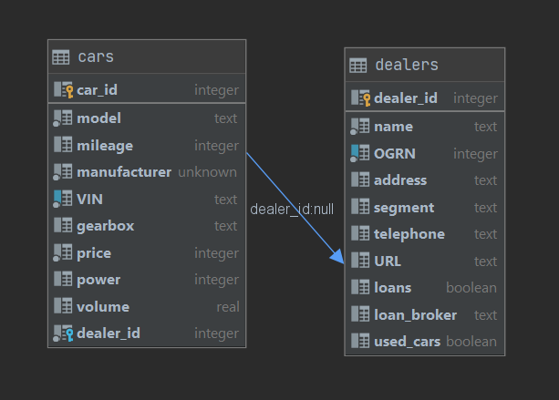

# Задание: 
1. Создать небольшое REST API на Python (можно использовать любые библиотеки и framework-и, в т.ч. Flask).
2. Требуется создание только бэкэнд части, в readme файле желательно описать endpoint и примеры запросов (будет плюсом наличие файлов-схем запросов, например JSON Schema).
3. Данное API должно поддерживать CRUD операции.
4. Тематика данного API связана с продажами машин автодилерами. Модель данных (в т.ч. описание и взаимодействие между классами "Машина" и "Дилер") можете разработать любую, на ваше усмотрение, но соответствующую условиям выше. 

# Использованные библиотеки
## Встроенные
- logging
## Сторонние
- flask - фреймворк для разработки веб-приложений
- flask-sqlalchemy - ORM для СУБД (SQLite3)
- flask-marshmallow - serializer/deserializer JSON
- flask-restful - библиотека для удобного роутинга

# Установка (linux)

1. Склонируйте этот репозиторий
```
git clone https://github.com/chetambrat/RESTful_car_service
```
2. Перейдите в папку
```
cd WeatherProject
```
3. Установите venv
```
pip install venv
```
4. Перейдите в venv
```
source venv/bin/activate
```
5. Установите зависимости
```
pip install -r requirements.txt
```
5. Запустите приложение
```
export FLASK_APP=app.py
flask run
```
Приложение будет доступно по адресу http://127.0.0.1:5000/
# Структура БД


## Таблица dealers
- dealer_id - primary_key
- name - наименование предприятия
- ogrn - идентификатор ogrn - должен быть уникальным и иметь тип integer
- address - полный фактический адрес
- segment - сегмент реализуемых автомобилей: дешевый, средний и премиальный
- telephone - телефон формата +79*** 
- URL - полный веб-адрес
- loans - бинарная переменная - имеют ли дилеры возможность оформления авто в кредит
- loan_broker - банк, предоставляющий услуги кредитования
- used_cars - бинарная переменная - реализует ли дилер подержанные автомобили

|dealer_id|name|OGRN|address|segment|telephone|URL|loans|loan_broker|used_cars|
|:----|:----|:----|:----|:----|:----|:----|:----|:----|:----|
|0|RALF|1239139512|Moscow, Aviamotornaya st., 93, office 45|middle|+79157881921|https://rolf.ru|1|Tinkoff|1|
|1|BMW|13219519591|Moscow, Arsenalnaya st., 156, office 671|premium|+79257156111|https://bmw.ru|1|Raiff|0|
|2|roga|13378888|Moscow, Moscow city, Deluxe tower, apartments 12901|premium|+79851230011|https://roga.com|1|vtb|0|
|3|Lada|8123171851|Vladivostok, Lenin st., 191, office 2213|cheap|+79009991666|https://lada.ru|1|Vostochniy|1|

## Таблица cars

- car_id - primary key
- model - модель автомобиля
- mileage - пробег - integer
- manufacturer - производитель
- vin - VIN автомобиля - уникален
- gearbox - тип коробки передач - бывает только автоматической, ручной и другой
- price - цена - integer
- power - мощность в л.с. - integer
- volume - расход в литрах - вещественная
- dealer_id - foreign key к ключу dealer_id таблицы dealers

|car_id|model|mileage|manufacturer|VIN|gearbox|price|power|volume|dealer_id|
|:----|:----|:----|:----|:----|:----|:----|:----|:----|:----|
|0|Solaris|0|Hyundai|KASDA2131314121931|auto|2315000|135|4.7|0|
|1|Rio|30000|Kia|KIOQW2131314113515|auto|1800000|123|4.2|0|
|2|Lauren|15000|Ralph|RALP13159123151|manual|2256000|139|3.9|0|
|3|X5|0|BMW|BMW16181313|manual|3560000|240|5.1|1|
|4|X6|0|BMW|BMW1612931931313|auto|4250000|260|5.7|1|

# API endpoints
## Для доступа к конкретному дилеру
### URL `/dealers`
### Method `GET`
### Пример запроса
```yaml
{'$schema': 'http://json-schema.org/schema#', 'type': 'object', 'properties': {'dealer_id': {'type': 'string'}}, 'required': ['dealer_id']}
```
### Ограничения
- Существование конкретного дилера по его dealer_id

## Для записи информации о конкретном дилере
### URL `/dealers`
### Method `POST`
### Пример запроса
```yaml
{'$schema': 'http://json-schema.org/schema#', 'type': 'object', 'properties': {'name': {'type': 'string'}, 'ogrn': {'type': 'string'}, 'address': {'type': 'string'}, 'segment': {'type': 'string'}, 'telephone': {'type': 'string'}, 'url': {'type': 'string'}, 'loans': {'type': 'string'}, 'loan_broker': {'type': 'string'}, 'used_cars': {'type': 'string'}}, 'required': ['address', 'loan_broker', 'loans', 'name', 'ogrn', 'segment', 'telephone', 'url', 'used_cars']}
```
### Ограничения
- Уникальный идентификатор ОГРН
- Segment должен быть одним из
> ["cheap", "middle", "premium"]
- Телефон должен соответстовать шаблону +79XXXXXXXXX, где X - цифры
- URL сайта должен начинаться с https:\\ и соотствовать шаблону XXX.YYY
- Некоторые переменные имеют ограничения на длину символов
- Некоторые переменные принимают только boolean значения

## Для изменения информации о конкретном дилере
### URL `/dealers`
### Method `PUT`
### Пример запроса
```yaml
{'$schema': 'http://json-schema.org/schema#', 'type': 'object', 'properties': {'name': {'type': 'string'}, 'ogrn': {'type': 'string'}, 'address': {'type': 'string'}, 'segment': {'type': 'string'}, 'telephone': {'type': 'string'}, 'url': {'type': 'string'}, 'loans': {'type': 'string'}, 'loan_broker': {'type': 'string'}, 'used_cars': {'type': 'string'}, 'dealer_id': {'type': 'string'}}, 'required': ['address', 'dealer_id', 'loan_broker', 'loans', 'name', 'ogrn', 'segment', 'telephone', 'url', 'used_cars']}
```
### Ограничения
- Такие же как и в POST, только теперь требуется указать существующий dealer_id

## Для удаления информации о конкретном дилере
### URL `/dealers`
### Method `DELETE`
### Пример запроса
```yaml
{'$schema': 'http://json-schema.org/schema#', 'type': 'object', 'properties': {'dealer_id': {'type': 'string'}}, 'required': ['dealer_id']}
```
### Ограничения
- Такие же как и в GET

## Для доступа к конкретному автомобилю
### URL `/cars`
### Method `GET`
### Пример запроса
```yaml
{'$schema': 'http://json-schema.org/schema#', 'type': 'object', 'properties': {'car_id': {'type': 'string'}}, 'required': ['car_id']}
```
### Ограничения
- Существование конкретного автомобиля по его car_id

## Для записи информации о конкретном автомобиле
### URL `/cars`
### Method `POST`
### Пример запроса
```yaml
{'$schema': 'http://json-schema.org/schema#', 'type': 'object', 'properties': {'model': {'type': 'string'}, 'manufacturer': {'type': 'string'}, 'mileage': {'type': 'string'}, 'vin': {'type': 'string'}, 'gearbox': {'type': 'string'}, 'price': {'type': 'string'}, 'power': {'type': 'string'}, 'volume': {'type': 'string'}, 'dealer_id': {'type': 'string'}}, 'required': ['dealer_id', 'gearbox', 'manufacturer', 'mileage', 'model', 'power', 'price', 'vin', 'volume']}
```
### Ограничения
- Уникальный идентификатор vin
- Gearbox должен быть одним из
> ["auto", "manual", "other"]
- Dealer_id должен быть одним из существующих на данный момент
- Некоторые переменные имеют ограничения на длину символов
- Некоторые переменные принимают только boolean значения

## Для изменения информации о конкретном автомобиле
### URL `/cars`
### Method `PUT`
### Пример запроса
```yaml
{'$schema': 'http://json-schema.org/schema#', 'type': 'object', 'properties': {'model': {'type': 'string'}, 'manufacturer': {'type': 'string'}, 'mileage': {'type': 'string'}, 'vin': {'type': 'string'}, 'gearbox': {'type': 'string'}, 'price': {'type': 'string'}, 'power': {'type': 'string'}, 'volume': {'type': 'string'}, 'dealer_id': {'type': 'string'}, 'car_id': {'type': 'string'}}, 'required': ['car_id', 'dealer_id', 'gearbox', 'manufacturer', 'mileage', 'model', 'power', 'price', 'vin', 'volume']}
```
### Ограничения
- Такие же как и в POST, только теперь требуется указать существующий car_id

## Для удаления информации о конкретном автомобиле
### URL `/cars`
### Method `DELETE`
### Пример запроса
```yaml
{'$schema': 'http://json-schema.org/schema#', 'type': 'object', 'properties': {'car_id': {'type': 'string'}}, 'required': ['car_id']}
```
### Ограничения
- Такие же как и в GET